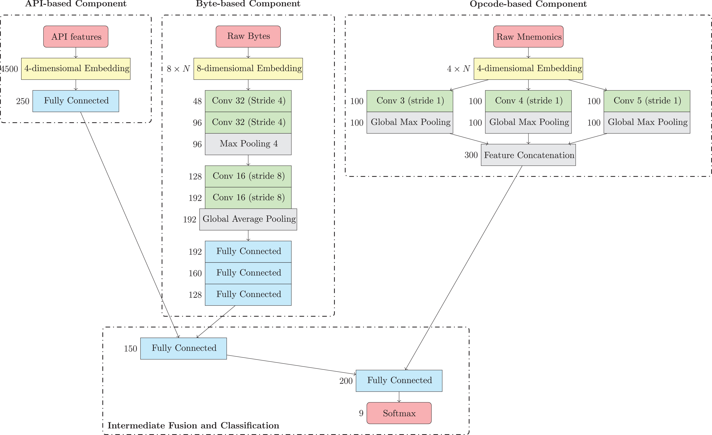
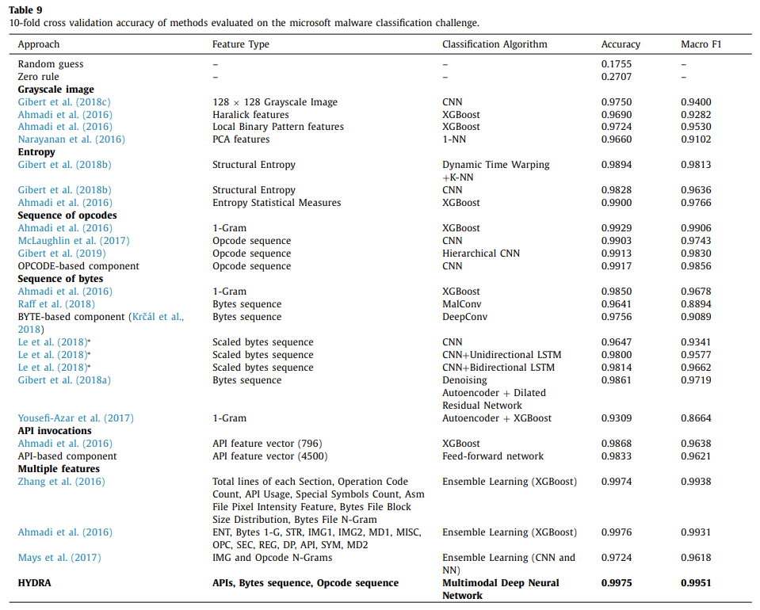

This paper proposes a multimodal deep learning system to categorize malware into families that involves multiple modalities of data:
* The list of Windows API functions calls.
* The sequence of assembly language instructions representing malware’s assembly language source code.
* The sequence of hexadecimal values representing malware’s binary content.

