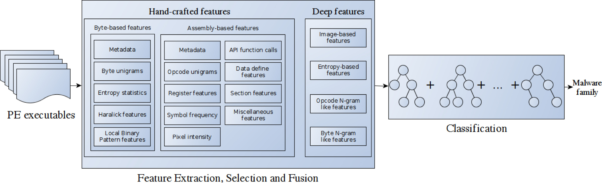

While traditional feature-based approaches rely on the manual design of hand-crafted features based on experts’ 
knowledge of the domain, deep learning approaches replace the manual feature engineering process by an underlying system, 
typically consisting of a neural network with multiple layers, that perform both feature learning and classification altogether.

In this paper we present an hybrid approach to address the task of malware classification by fusing multiple types of 
features defined by experts and features learned through deep learning from raw data. 

In particular, our approach relies on deep learning to extract N-gram like features from the assembly language instructions
and the bytes of malware, and texture patterns and shapelet-based features from malware’s grayscale image representation
and structural entropy, respectively. 

These deep features are later passed as input to a gradient boosting model that combines the deep features and the
hand-crafted features using an early-fusion mechanism. 

The suitability of our approach has been evaluated on the Microsoft Malware Classification Challenge benchmark and 
results show that the proposed solution achieves state-of-the-art performance and outperforms gradient boosting and
deep learning methods in the literature.

