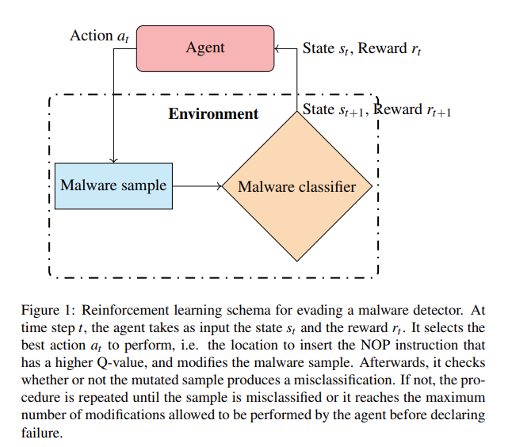

It has been shown that machine learning models, in particular deep neural
networks, lack robustness against crafted inputs (adversarial examples). In this work, we have investigated the vulnerability of a
state-of-the-art shallow convolutional neural network malware classifier against the dead code insertion technique.

We propose a
general framework powered by a Double Q-network to induce misclassification over malware families. The framework trains an
agent through a convolutional neural network to select the optimal positions in a code sequence to insert dead code instructions so
that the machine learning classifier mislabels the resulting executable.

The experiments show that the proposed method significantly
drops the classification accuracy of the classifier to 56.53% while having an evasion rate of 100% for the samples belonging to the
Kelihos_ver3, Simda, and Kelihos_ver1 families. In addition, the average number of instructions needed to mislabel malware in
comparison to a random agent decreased by 33%.