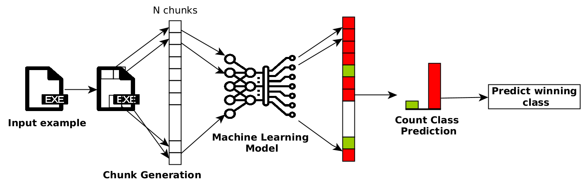

End-to-end malware detectors have been shown to be susceptible to adversarial malware examples, i.e. malicious examples
that have been deliberately manipulated to evade detection. In this work, we present a practical and certifiable defense 
against patch and append attacks on malware detection. Our defense adapts the concept of (de)randomized smoothing to the 
task of malware detection. 

Our defense, instead of taking as input the whole byte sequences, operates on subsequences of bytes. It works as follows:
* During the training phase, a base classifier is trained to make classifications based on a subset of contiguous bytes or chunk of bytes from an executable. 
* At test time, an executable is divided into non-overlapping chunks of fixed size. Then, each chunk is classified independently. 
The final classification is the majority vote over the predicted classes of the chunks.

Leveraging the fact that patch and append attacks can only influence a certain number of chunks, we derive meaningful large
robustness certificates against both attacks. To demonstrate the suitability of our approach, we have trained a classifier
with our chunk-based scheme on the BODMAS dataset. We show that the proposed chunk-based smoothed classifier is more robust
against state-of-the-art evasion attacks in comparison to a non-smoothed classifier.

The following figure illustrates our (de)randomized smoothing scheme: