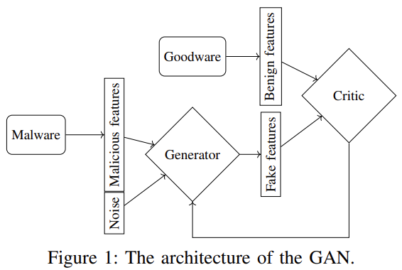

Methods to generate adversarial malware examples are based on unrealistic assumptions, such as having access to the
model's gradients or outputs, or either querying a black-box system (the target malware detector) thousands of times, which is unfeasible
in real-world attacks due to practical limitations, including detection risks, resource constraints and timme inefficiencies.

This work presents a novel query-free approach to craft adversarial malware examples to evade ML-based malware detectors. We 
introduce a GAN-based framework to generate adversarial malware examples that look similar to benign executables in the feature space.

To demonstrate the suitability of our approach we have applied the GAN-based attack 
to three common types of features usually employed by static ML-based malware detectors: (1) Byte histogram features, 
(2) API-based features, and (3) String-based features. Results show that our model-agnostic approach performs on par
with MalGAN, while generating more realistic adversarial malware examples without requiring any query to the malware
detectors. Furthermore, we have tested the generated adversarial examples against state-of-the-art multimodal and deep 
learning malware detectors, showing a decrease in detection performance, as well as a decrease in the average number 
of detections by the antimalware engines in VirusTotal.
