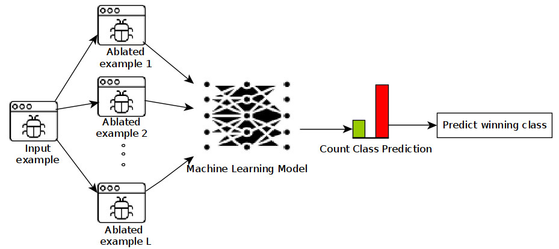

Malware detectors based on deep learning (DL) have been shown to be susceptible to malware examples that have been 
deliberately manipulated in order to evade detection - known as adversarial malware examples. More specifically, it 
has been show that deep learning detectors are vulnerable to small changes on the input file. 

Given this vulnerability of deep learning detectors, we propose a practical defense against adversarial malware examples
inspired by randomized smoothing. In our work, instead of employing Gaussian or Laplace noise when randomizing inputs,
we propose a randomized smoothing scheme that randomly ablates a percentage of the bytes within an executable. 
Our approach works as follows:
* During training, our randomized smoothing scheme trains a base classified based on ablated versions of the executable files.
* At inference time, we generate N ablated versions of a given input example, classify each chunk independently, and 
take the majority vote as the final classification.

The following figure illustrates our randomized smoothing scheme:

This adversarial defense slightly increases the robustness of end-to-end malware detectors against adversarial attacks. 
However, state-of-the-art attacks that inject huge payloads have been shown to bypass our defense.