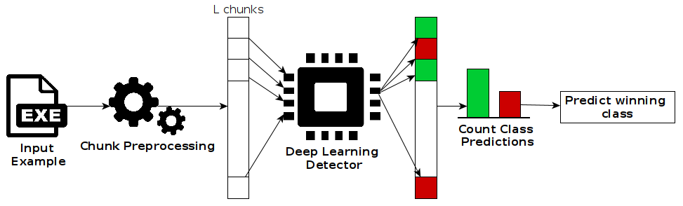
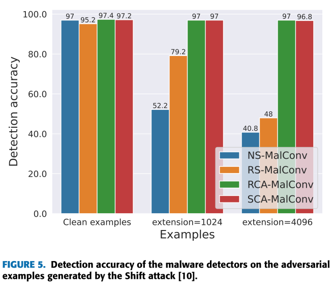
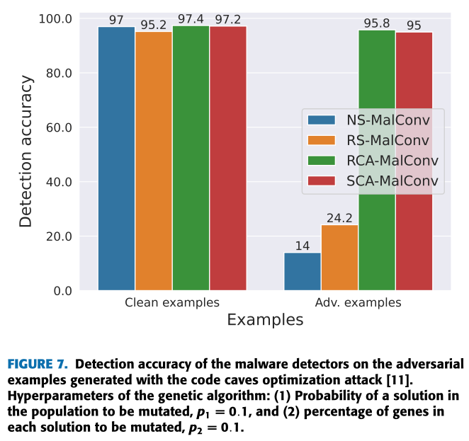

In this work,  we propose a chunk-based smoothing scheme that reduces the chances of sampling adversarial content injected by malware authors by selecting 
correlated subsets of bytes. Our approach works as follows:
* During training, our chunk-based smoothing scheme trains a base classifier to make classifications on 
a subset of contiguous bytes or chunk of bytes. 
* At test time, a large number of chunks are then classified by a base
classifier and the consensus among these classifications is then reported as the final prediction.

The following figure illustrates our adversarial defense:

We propose two strategies to determine the location of the chunks used for classification: (1) randomly selecting the locations
of the chunks (RCA) and (2) selecting contiguous adjacent chunks (SCA).

The RCA scheme has three key components:
- Sampling L chunks randomly from the input sequence using a uniform distribution.
- Classifying each chunk independently.
- Combining the classification results by taking a majority vote.

The SCA scheme samples chunks in an orderly way from the start of the input byte sequence to its end, instead of randomly sampling chunks. The SCA scheme has three key components:
- Sampling L sequentially adjacent chunks from the input sequence.
- Classifying each chunk independently.
- Combining the classification results by taking a majority vote.

To showcase the effectiveness of our approach, we have trained two classifiers with our chunk-based smoothing schemes on the BODMAS dataset. 
Our findings reveal that the chunk-based smoothing classifiers exhibit greater resilience against adversarial malware examples generated  
with state-of-the-art evasion attacks, outperforming a non-smoothed classifier and a randomized smoothing-based 
classifier by a great margin.

