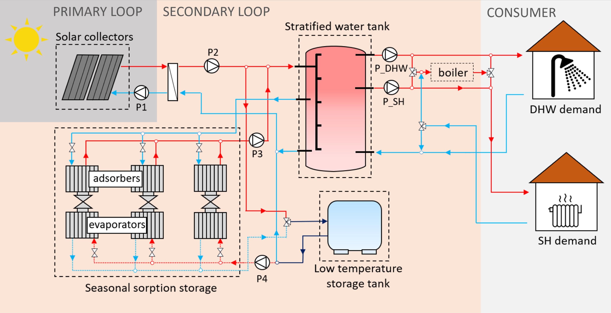

In this paper, we analyze the competitiveness of deep reinforcement learning (DRL) to control a solar-driven seasonal 
sorption TES system in comparison to a traditional optimized rule-based control strategy.

The operation of sorption TES systems is notably more complicated compared to other TES variants. The discharge of a
sorption TES occurs at a particular desorption and 
evaporation temperature. Achieving a continuous and efficient discharge of a sorption TES is a challenging control task 
if heat required at the evaporator is obtained from the sun or the environment. Its operation is especially complicated
during winter, because of the limited availability of solar irradiation and low ambient temperatures.

The system,
located in Central Europe, supplied domestic hot water and space heating to a single-family house. Two DRL models were
developed and trained to operate the system under two different sets of data: 120 winter consecutive days and 60 winter
non-consecutive days. The results showed that the DRL control strategy reduced the system operational costs by 28% in a 
60 winter days scenario. For a 120 winter days scenario, the operational cost savings decreased to 13% because the smart
control performed worst once the sorption TES was fully discharged. These results were derived from a four-year validation
data set, bolstering their robustness. The study demonstrates the successful application of DRL in controlling a
solar-driven seasonal sorption TES system, yielding considerable economic savings compared to an RBC strategy. 
Subsequent work will consist of implementing the smart control strategy at prototype level to assess its performance.